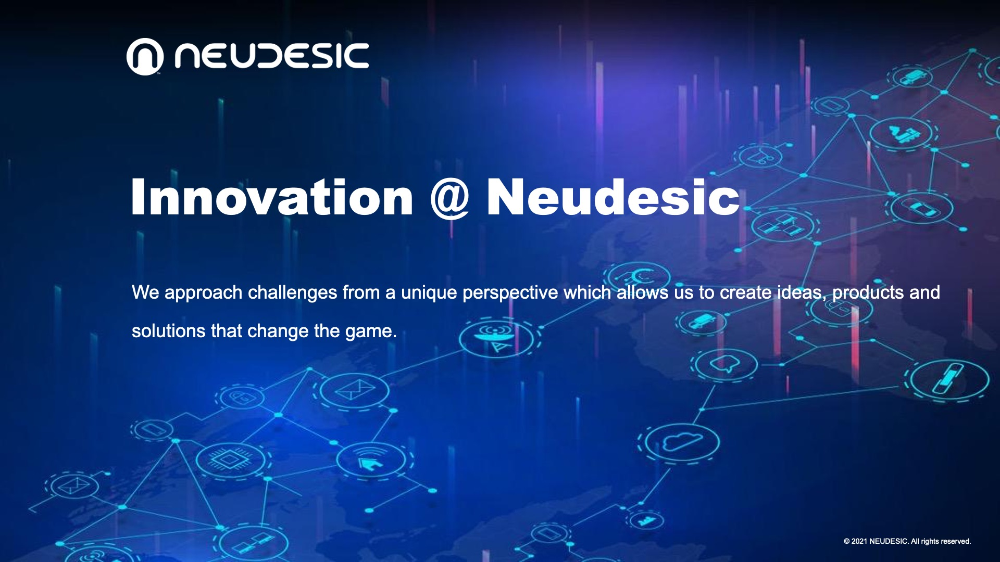

# Innovation @ Neudesic

Who is Neudesic? We love what we do and we do what we love: building really cool technology solutions for ourselves and our clients. We are passionnate about succeeding and taking on challenges that others hide from. We believe in being innovative and pushing each other to grow every day. We embrace conflict, trust and commit to each other, and we pursue excellence in everything that we do. We are Neudesic!

To learn more about Neudesic and the services that we provide, check out our [website](https://www.neudesic.com).

## Our Innovation Community

Innovation is a core value of Neudesic. We are constantly working to build better tools, products, and services for our customers and each other. At Neudesic, we have adopted [innersource](https://resources.github.com/whitepapers/introduction-to-innersource/) techniques and collaborate with our peers globally. We are working on some very cool ideas and are always on the lookout for new and talented people to join our team.

If you have a passion for building amazing solutions, and are looking for a strong community that will treasure and encourage your talents, come join our team. Check out the [Neudesic Careers](https://www.neudesic.com/careers/) site and see what opportunities that we have around the United States or our Global Services division in India.

2021 has been a big year for Neudesic and 2022 is going to be even more exciting! Come work with the best and smartest people you'll ever find in a single company and join the Neudesic team today!

## Innersource @ Neudesic

At Neudesic, we use GitHub Enterprise as our playground for exploring, building, and sharing new ideas, and collaborating to make those ideas better. All Neudesic employees are encouraged to participate in our Innersource community and develop the next generation of solutions, tools, or products that will help grow our business and provide value to our customers.

If you are a Neudesic employee and want to get involved with Innersource @ Neudesic, talk to your manager or practice director for guidance on how to get a GitHub Enterprise account.

We have established several repositories with tips, tricks, and documentation to help you to get started with our Innersource community:

* [GitHub Best Practices](https://github.com/neudesic/github-best-practices)
* [Code of Conduct for Innersource](https://github.com/neudesic/intro-to-innersource/blob/main/CODE_OF_CONDUCT.md)

Join our Innersource community and get started! We're waiting for you!
